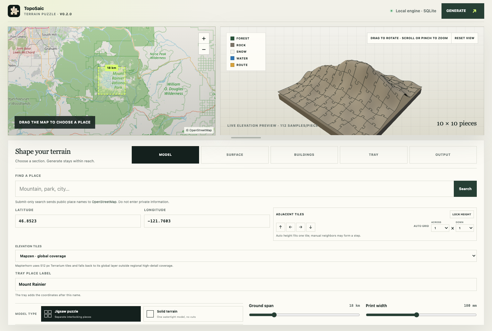
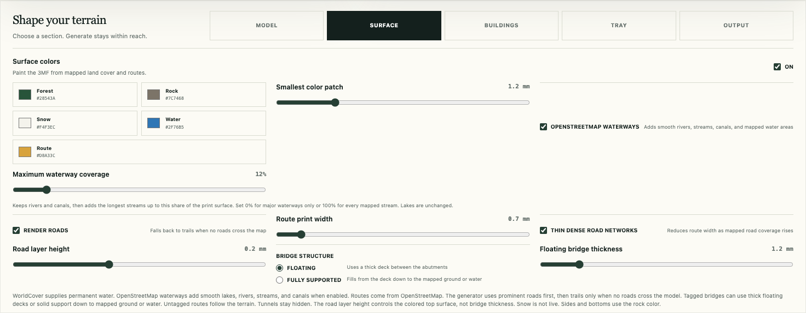

# TopoSaic

*Terrain Puzzle*

TopoSaic is a local-first topographic puzzle generator. A Rust service
samples worldwide elevation data, builds watertight pieces with round jigsaw
tabs and sockets, and stores job state in SQLite. The web app lets you choose a
place and tune the printable model, including the mesh detail and surface
colors.

## Download

Download the latest desktop build from
[TopoSaic Releases](https://github.com/theatrus/toposaic/releases):

- Windows x64: `.exe` setup or `.msi` installer
- macOS Apple silicon: `.dmg` disk image or `.app.zip` application archive
- Linux x86-64: portable `.AppImage`

Release and trusted `main` macOS builds use a Developer ID signature, Apple
notarization, and stapled tickets. Pull-request bundles use an ad-hoc signature
and never receive signing credentials. On Linux, make the AppImage executable
with `chmod +x` before opening it.

## Screenshots



*Choose a place beside a live, rotatable preview, then shape the model below.*



*Tune print colors, mapped layers, road detail, and bridge structure in place.*

An optional shallow tray exports as its own watertight STL and color 3MF. Its
flat well shows smooth, continuous equal-height contour lines as fine color
inlays. Raised text on the front top lip shows the chosen place name, latitude,
and longitude in smooth vector letterforms. Controls set the tray clearance,
rim, floor, line count, and three print colors. The bundled Atkinson
Hyperlegible font keeps the label shape the same on every OS and remains under
its included SIL Open Font License.

Solid terrain mode exports the same mapped relief as one watertight STL and 3MF
model with a straight outer edge and no puzzle seams. It keeps the full source
sampling grid while limiting the single mesh to a safe detail level.

Piece layouts range from 2×2 to 16×16. The default 10×10 layout makes 100
pieces with narrow-necked, round puzzle knobs like a standard jigsaw.

The elevation provider reads Mapzen Terrarium tiles from the AWS Open Data
registry. The service caches elevation, ESA WorldCover, and OpenStreetMap input
under the operating system's user cache directory. OpenStreetMap entries keep
the raw response, so width, density, color, and visibility changes reuse the
same download.

For uncached requests, the service tries a second public Overpass instance when
the first rejects or cannot serve the request. If both fail, generation
continues without that OSM layer. WorldCover water and terrain output remain
available. Concurrent jobs share each cache fill, and the service tries the last
working public instance first on its next request. It retries a failed fetch
once and rejects HTTP 200 responses that contain an Overpass timeout remark, so
it never caches a partial building set. Set `OVERPASS_BASE_URL` to use one
specific Overpass instance.

Color mode reads 10 m ESA WorldCover 2021 data through HTTP range requests. It
maps tree cover, bare ground, snow or ice, and permanent water to editable
forest, rock, snow, and water colors. It also reads prominent roads from
OpenStreetMap through Overpass, then draws motorway, trunk, primary, and
secondary roads as smooth, print-safe vector lines. If none cross the selected
area, it draws paths, footways, bridleways, tracks, and cycleways as a trail
fallback. Rivers, streams, canals, and mapped water areas use the same vector
path so they stay smooth and flush with the terrain. Building footprints keep
their straight mapped edges, with dense local mesh detail along each wall
instead of a blocky whole-map sampling edge. The 3MF stores standard triangle
color properties.
Roads also rise by one configurable print-layer height, which defaults to 0.2
mm. Road width starts at 0.7 mm and can thin automatically in dense road
networks. Roads tagged as bridges in OpenStreetMap interpolate a deck between
their DEM-height abutments instead of dropping into the ravine or water below.
Untagged roads still follow the terrain, and `layer=*` is not treated as a
height. OpenStreetMap water can be disabled without hiding WorldCover water.
The waterway coverage cutoff always keeps rivers and canals, then keeps the
longest streams until their estimated printed area reaches the chosen share of
the model. Set it to 0% for major waterways only or 100% for every mapped
stream. Mapped water areas do not use this cutoff.
STL files stay single-color but retain the raised road geometry.

Overlay detail is separate from the base terrain setting. It defaults to 112
samples per piece and can rise to 192, giving roads, buildings, water, snow,
forest, and rock boundaries a finer mesh without forcing the same setting on
plain terrain jobs. Generated browser previews use up to 384 samples across the
assembled map.

Building mode reads OpenStreetMap footprints and raises them above the terrain.
It uses tagged height first, then floor count, then an 8 m default. Its own Z
scale controls vertical exaggeration against the map's plan scale. Buildings
can run with or without surface color output. In color output, roofs and walls
use their own editable building material instead of inheriting the land-cover
color beneath each footprint.

Place search uses explicit, user-submitted OpenStreetMap Nominatim queries
through the Rust service. Results are cached in SQLite and outbound requests
are limited to one per second. Set `NOMINATIM_BASE_URL` to use another
compatible service. Review the
[public service policy](https://operations.osmfoundation.org/policies/nominatim/)
before wider or commercial use.

The preview asks for a 64×64 real elevation sample after the location or ground
span has been still for 450 ms. This gives the relief pane useful terrain before
a full mesh job starts. It uses the same tile cache as generation. A completed
job replaces it with the detailed generated preview. The preview is a lit 3D
height mesh: drag or use the arrow keys to orbit, and scroll, pinch, or use the
plus and minus keys to zoom.

## Requirements

- Rust 1.96 or newer
- Node.js 22.13 or newer
- Windows 10 or 11 for the Windows desktop bundle
- A 64-bit Linux system for the Linux AppImage

## Run

Start the Rust API:

```bash
cargo run -p terrain-api
```

In a second terminal, start the website:

```bash
npm install
npm run dev
```

Open `http://127.0.0.1:3100`. The Rust API listens on
`http://127.0.0.1:8787`.

### Desktop app

The Tauri app uses the same React controls and starts the Rust engine inside the
app process, so it does not need a second terminal:

```bash
npm install
npm run tauri dev
```

Build the desktop app with:

```bash
npm run tauri build
```

The desktop app keeps SQLite and generated jobs in its standard application
data directory. Downloaded map inputs still use the shared OS cache described
below. Each generated file opens a native Save As dialog, so the app does not
drop files into Downloads without asking.

GitHub Actions tests the shared code, then builds five desktop files: Windows
`.msi` and `.exe` installers, macOS `.app.zip` and `.dmg` bundles, and a Linux
`.AppImage`.
Each file appears as its own workflow artifact. Pushing a version tag such as
`v0.1.0` runs the same checks and attaches all five files to a GitHub Release.
The tag must match the version in `src-tauri/tauri.conf.json`. The macOS build
from a trusted push is Developer ID signed, notarized by Apple, stapled, and
checked with Gatekeeper before upload. Pull-request macOS bundles remain
ad-hoc signed and cannot read the protected signing secrets.

The trusted macOS job uses a protected GitHub environment named `signing` with
these environment secrets:

- `APPLE_BUILD_CERTIFICATE`: base64-encoded Developer ID Application `.p12`
- `APPLE_BUILD_CERTIFICATE_PASSWORD`: password for that `.p12`
- `KEYCHAIN_PASSWORD`: password for the temporary CI keychain
- `APPLE_API_ISSUER`: App Store Connect team API issuer ID
- `APPLE_API_KEY`: App Store Connect team API key ID
- `APPLE_API_KEY_PRIVATE`: base64-encoded `AuthKey_<KEY_ID>.p8`

The workflow deletes its temporary keychain, certificate, and API key even when
the build fails.

On Linux, make the downloaded AppImage executable before opening it:

```bash
chmod +x TopoSaic-*-linux-x86_64.AppImage
./TopoSaic-*-linux-x86_64.AppImage
```

Windows builds use the Universal CRT that Windows 10 and 11 include and service.
CI checks each executable's DLL imports and fails if it adds a `VCRUNTIME`,
`MSVCP`, or `CONCRT` dependency that would need a Visual C++ Redistributable
install. It also checks that release executables use the Windows GUI subsystem,
so the app does not open a console window. The installers download Microsoft's
WebView2 bootstrapper only when the system does not already have WebView2.

## Storage

SQLite and generated jobs live under `data/`, which Git ignores. Set
`TERRAIN_DATA_DIR` to use another directory.

Downloaded map inputs use the standard per-user cache path:

- macOS: `~/Library/Caches/com.theatrus.toposaic`
- Linux: `$XDG_CACHE_HOME/toposaic` or `~/.cache/toposaic`
- Windows: `%LOCALAPPDATA%\theatrus\toposaic\cache`

Set `TERRAIN_CACHE_DIR` to override that path. The cache keeps elevation PNG
tiles, full ESA WorldCover GeoTIFF tiles, and OpenStreetMap route responses.
Writes use a temporary file and an atomic rename, so a stopped download does
not leave a valid-looking partial tile.

The browser uses `NEXT_PUBLIC_TERRAIN_API_URL` when set. See `.env.example`.

## Check

```bash
cargo test --workspace
cargo clippy --workspace --all-targets -- -D warnings
npm test
npm run test:ui
```

## Project shape

- `crates/terrain-core`: puzzle edges, terrain surface, watertight meshes,
  binary STL, and standards-based 3MF
- `apps/api`: global elevation provider, Axum API, SQLite jobs, background
  generation, ESA WorldCover sampling, and downloads
- `app`: WebGL-free map, color relief preview, print controls, and job downloads
- `desktop` and `src-tauri`: shared React entry point and native Tauri shell

See [the color output plan](docs/color-output-plan.md) for the design and print
checks behind the rock–forest–snow–water–road 3MF workflow.

## Terrain data

Mapzen Terrain Tiles combine several regional and global public elevation
sources. Generated manifests record the source and link to the required
attribution notices:

<https://github.com/tilezen/joerd/blob/master/docs/attribution.md>

Color manifests also record the ESA WorldCover tile and attribution:

<https://esa-worldcover.org/en/data-access>

When OpenStreetMap overlays are on, manifests also record their source and
attribution. Overpass responses use the same OS cache:

<https://www.openstreetmap.org/copyright>

Publicly shared prints, images, and generated files must retain the data-source
credits recorded in their manifest or place those credits near the work. See
[third-party licenses and data](THIRD_PARTY_NOTICES.md).

## License

TopoSaic source code and documentation are licensed under the
[Apache License 2.0](LICENSE). Third-party software, the bundled font, and map
data keep their own licenses; see [THIRD_PARTY_NOTICES.md](THIRD_PARTY_NOTICES.md)
and [assets/fonts/OFL.txt](assets/fonts/OFL.txt).
