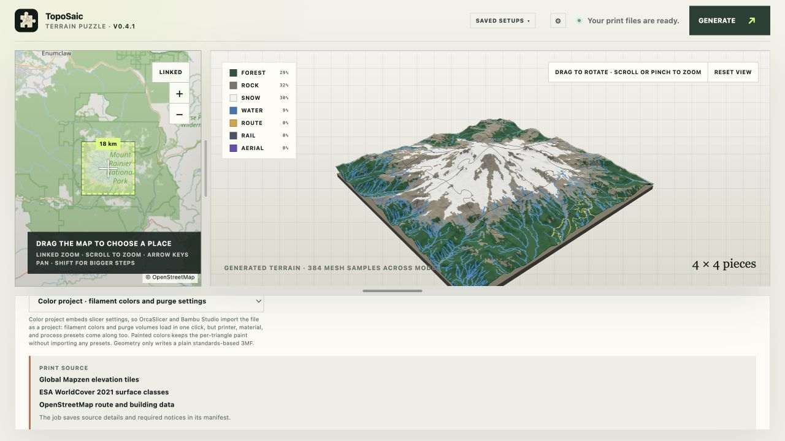
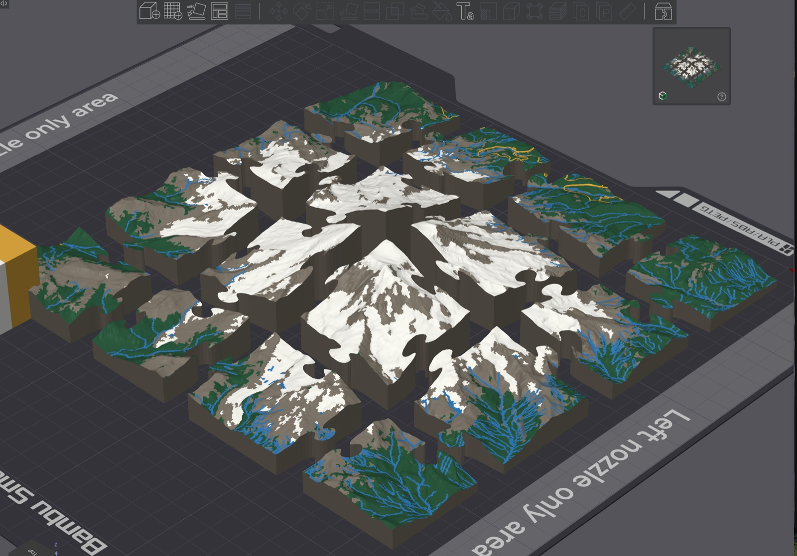
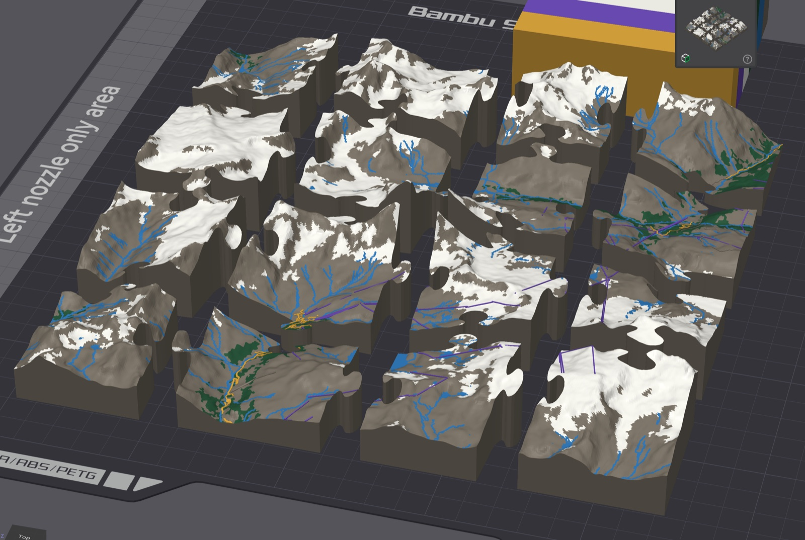
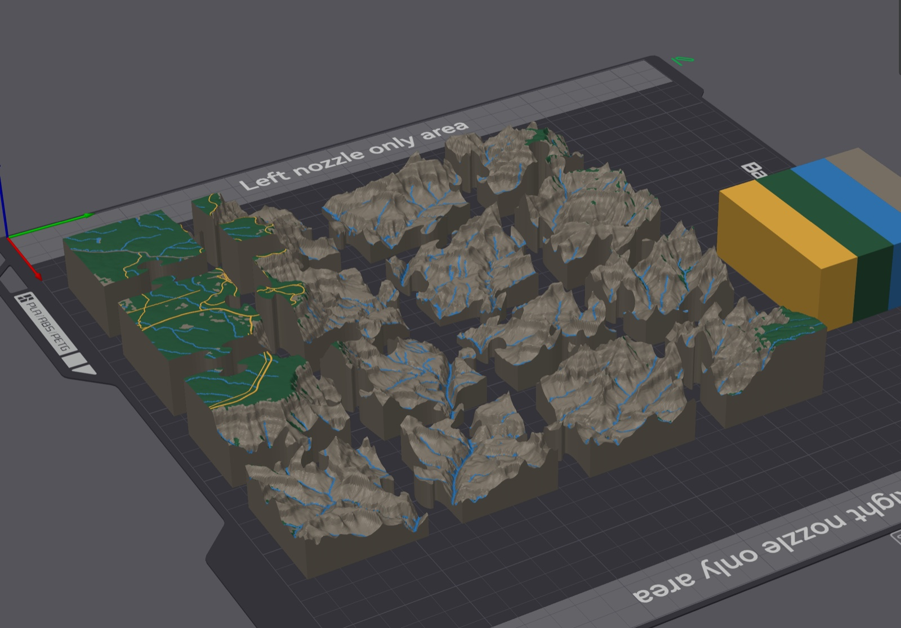
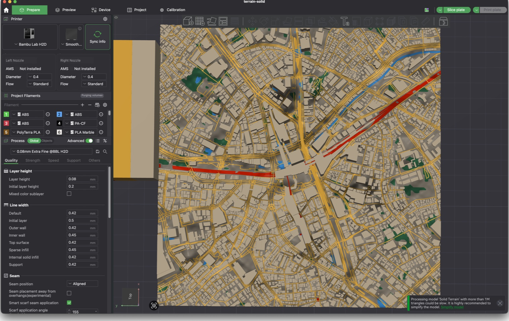
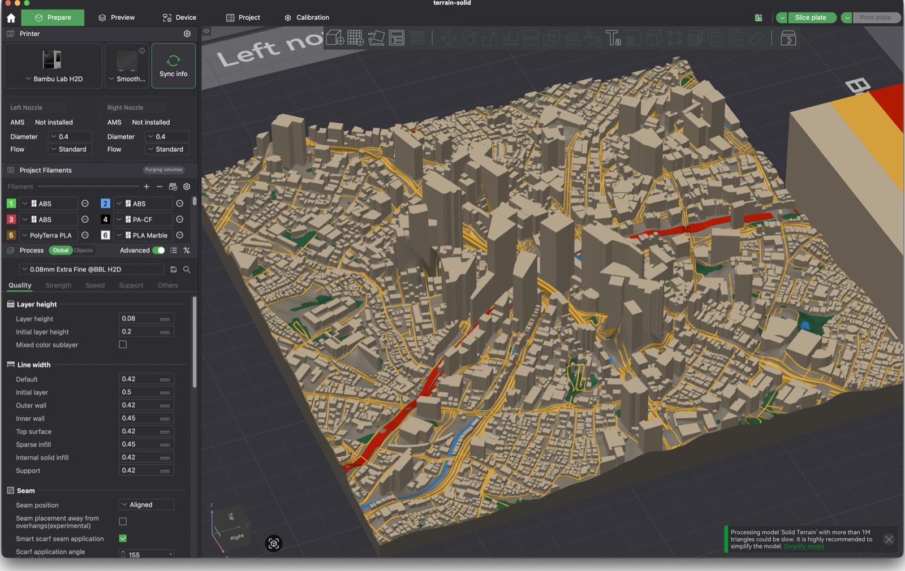
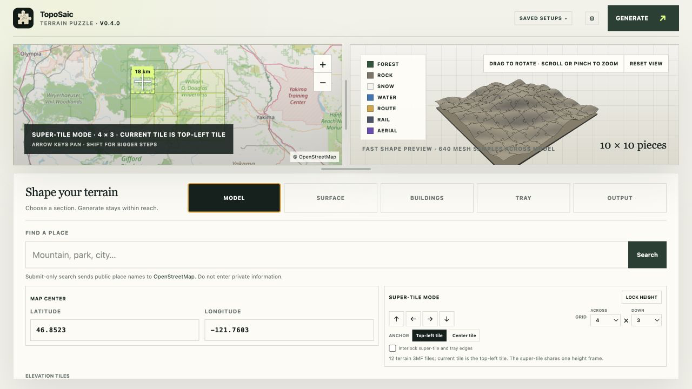
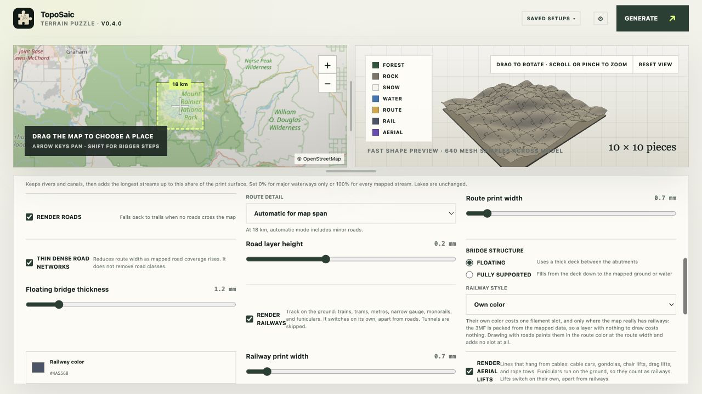
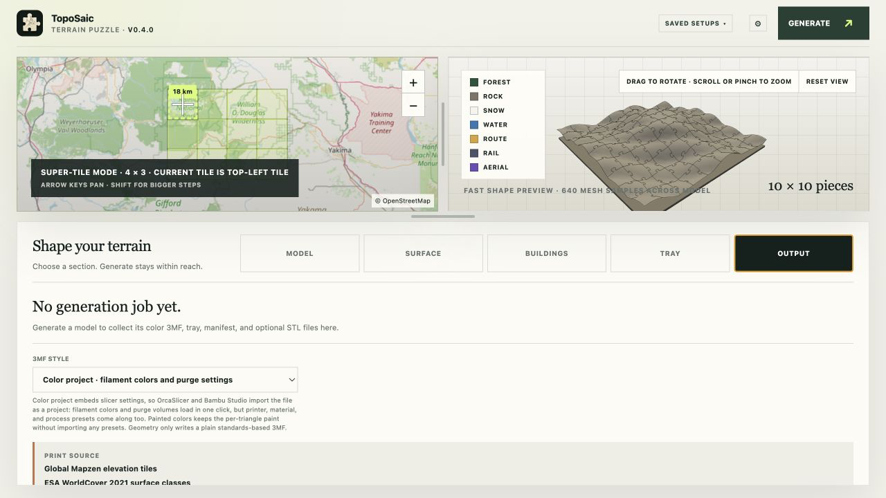
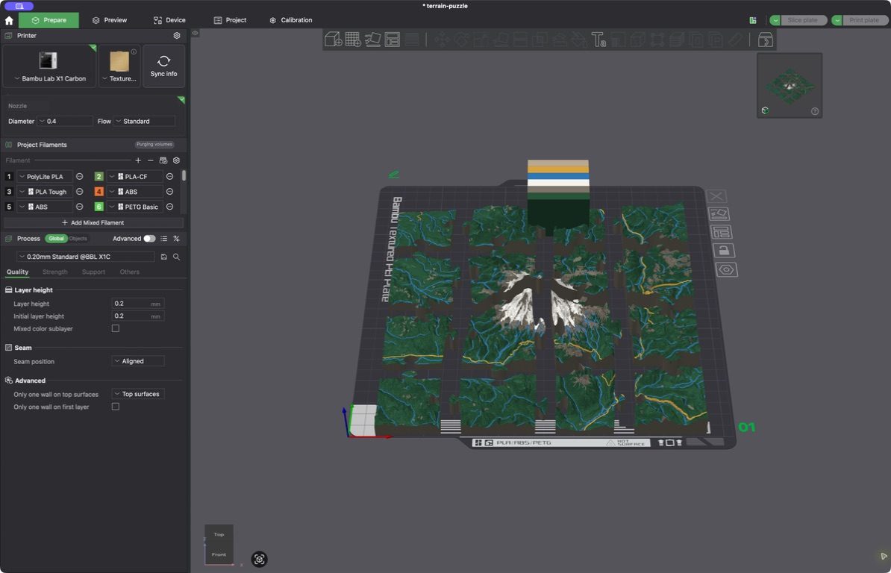

# TopoSaic

*Terrain Puzzle*

The name TopoSaic is a portmanteau of *topographic mosaic*.

TopoSaic is a local-first topographic puzzle generator. Its Rust engine
samples worldwide elevation data, builds watertight pieces with round jigsaw
tabs and sockets, and stores job state in SQLite. The desktop app lets you
choose a place and tune the printable model beside a live 3D preview: mesh
detail, surface colors, mapped lines, buildings, trays, and export style.

## Download

The current desktop release is
[TopoSaic v0.6.1](https://github.com/theatrus/toposaic/releases/tag/v0.6.1).

| Platform | Downloads |
| --- | --- |
| Windows x64 | [Setup `.exe`](https://github.com/theatrus/toposaic/releases/download/v0.6.1/TopoSaic-0.6.1-windows-x64.exe) · [`.msi` installer](https://github.com/theatrus/toposaic/releases/download/v0.6.1/TopoSaic-0.6.1-windows-x64.msi) |
| macOS Apple silicon | [`.dmg` disk image](https://github.com/theatrus/toposaic/releases/download/v0.6.1/TopoSaic-0.6.1-macos-aarch64.dmg) · [`.app.zip` archive](https://github.com/theatrus/toposaic/releases/download/v0.6.1/TopoSaic-0.6.1-macos-aarch64.app.zip) |
| Linux x86-64 | [Portable `.AppImage`](https://github.com/theatrus/toposaic/releases/download/v0.6.1/TopoSaic-0.6.1-linux-x86_64.AppImage) |

macOS releases use a Developer ID signature, Apple notarization, and stapled
tickets. Windows installers use the GUI subsystem and do not open a terminal
window. On Linux, make the AppImage executable with `chmod +x` before opening
it. See [all releases](https://github.com/theatrus/toposaic/releases) for older
builds.

## Screenshots



*Choose a place beside a live, rotatable preview. When generation finishes,
the preview updates with the final terrain and mapped surface classes. The
workspace dividers can give the map, preview, or controls more room.*

### Generated output in Bambu Studio

| Mount Rainier | Matterhorn | Grand Canyon |
| --- | --- | --- |
|  |  |  |

#### Shibuya Station

| Full area | Angled detail |
| --- | --- |
|  |  |

These are Bambu Studio captures of real color 3MF output, not mock or
AI-generated terrain. Mount Rainier, the Matterhorn, and the Grand Canyon use
an 18 km ground span, a 180 mm model, a 4×4 puzzle layout, and the 384-sample
Draft mesh. The two Shibuya Station views show solid output with dense
buildings, roads, rail lines, and water. TopoSaic built all four places from
real elevation, ESA WorldCover, and OpenStreetMap data.

The top bar holds one saved-setups control, labeled with the recalled setup's
name. Open it to see every saved setup on its own row: click a name to recall
it, or use the row's Rename, Duplicate, and Delete actions. Rename turns the
name into an inline text box — the only place names are edited — and Duplicate
copies the setup under a free name like "Alps (2)" ready to retitle. Below the
list, Save current setup stores the model under a typed name (an existing name
is overwritten), Export writes every setup to a `toposaic-setups.json` file,
and Import reads such a file back, so setups can move between machines.

The recalled setup's row also carries its own Save, which reads "Saved" until
the model moves away from what was stored and then offers to write the change
back. Each row keeps a History: the last five specs a setup held before being
saved over, any of which can be rolled back to. Rolling back restores the
setup and loads it, replacing the model on screen, so it asks first — the same
in-row confirm that Delete uses. The spec it replaced becomes a version of its
own, so a rollback can itself be rolled back.

Next to it, a gear button opens the settings pane. It shows the map data
cache — elevation tiles, land cover, OpenStreetMap, and place search — with
each category's size and entry count plus the total. Clearing is always
manual: pick an age and clear older entries, or clear everything after a
confirm click. Nothing expires on its own, and the next generation
re-downloads what it needs.



*Set the map center beside the full super-tile controls. Move by one tile or
export a straight 4×3 mosaic under one shared height frame.*



*Tune road detail and height, dense-network thinning, floating or supported
bridges, railways, aerial lifts, and their print colors as separate layers.*



*Choose a full slicer project, painted colors without imported presets, or a
plain geometry-only 3MF. Each generated job puts its print files and source
manifest in this tab.*



*The exported 3MF keeps the puzzle pieces and their forest, rock, snow, water,
road, and building materials ready for a color print. See
[Printing in color](#printing-in-color) for how each slicer takes the palette.*

## Version 0.6.1 highlights

- Bleed the terrain color over a piece's side wall so a printed puzzle no
  longer wears a grey outline around every edge. The cut face below the bleed
  stays rock; "Edge color bleed" on the Surface tab sets how deep the band
  runs, or turns it off.

## Version 0.6 highlights

- Draw mapped ferry crossings as their own layer, in their own color or with
  the roads, alongside the railway and aerial lift layers.
- Place editable building highlights, color dots, blank flags, and named flags
  by latitude and longitude. Named flags emboss their editable text in a chosen
  bundled font; controls set the banner width, height, and text size. Manual
  surface labels follow the terrain, while raised plaques give text a flat
  backing; each label has its own print size and map rotation.
- Get only the filament colors a model actually prints. Two layers set to one
  color share a slot, a layer the map has none of costs nothing, and every slot
  names a real filament preset instead of leaving the slicer to guess. The
  Colors tab shows which filament number each layer prints from and reorders
  them to match the spools already loaded.
- Save a whole job to a folder in one step, print files or STLs, with the setup
  that made them written alongside. Saved setups offer to store changes when
  the model drifts from them, and keep their last five versions to roll back to.
- Save a stable puzzle seed and signed tile coordinates with each setup so
  later super-tile runs can make matching edges. Outer edge notches are
  optional and off by default.
- Turn the map by any bearing and pan it without moving the selected ground.
- Keep buildings in proportion as the view closes in, and read a base label
  cut to the precision its map can support — or leave the label off.

## Version 0.5 highlights

- Mount a full terrain tile or display base with printable straight pins,
  angled pins, or a flush French-cleat receiver. Matching wall hardware,
  screw clearance, alignment spacers, and shared cuts across puzzle pieces
  support both single models and large super-tile displays.
- Use linked map zoom to resize the selected ground area, or switch to
  map-only zoom while keeping the model span fixed.
- Scan the rebuilt Surface tab by terrain, water, roads and bridges, railways
  and lifts, or imported trails. Its layout adapts from wide desktop windows
  to narrow views.
- Scale roads and railways from mapped OpenStreetMap widths where available,
  with class minimums and a user-set maximum. Close views can strengthen
  estimated widths, while dense-network thinning leaves mapped widths real.
- Open color 3MF output as separated pieces in Bambu Studio and OrcaSlicer.
  New real-world examples cover mountain terrain and dense Shibuya buildings,
  roads, rail lines, and water.

## Version 0.4.1 highlights

- Repair isolated bad elevation samples before interpolation so one stray DEM
  value cannot create a terrain spike or break the surrounding mesh.
- Open update notes in the system browser from the desktop app while keeping
  the normal release download link unchanged.

## Version 0.4 highlights

- Save named model setups, move them between machines as JSON, resize both
  workspace splits, pan the map with arrow keys, and inspect or clear each map
  cache from the settings pane.
- Import GPX and KML routes as their own colored trail layer. Railways and
  aerial lifts now have separate controls, colors, heights, and optional line
  history.
- Choose project, painted, or geometry-based 3MF output to suit Bambu Studio,
  OrcaSlicer, and other slicers.
- High and Ultra detail generation use less time and memory. Elevation now
  follows the source sample lattice, land-cover edges blend at useful scales,
  and generated previews replace the draft view when jobs finish.
- Mesh, tray, building, overlay, and export code now reject bad input without
  crashing. Generated models pass stricter manifold checks before release.

## Solid terrain and piece layouts

Solid terrain mode exports the same mapped relief as one watertight STL and 3MF
model with a straight outer edge and no puzzle seams. It keeps the full source
sampling grid while limiting the single mesh to a safe detail level.

Piece layouts range from 2×2 to 16×16. The default 10×10 layout makes 100
pieces with narrow-necked, round puzzle knobs like a standard jigsaw. The model
controls also set the minimum solid thickness under the lowest terrain point.

## Vertical scale

The Model tab sets how tall the terrain prints, two ways. **Overall height**,
the default, fits the area's relief into the height you choose, so every area
prints the same height whatever the ground does — and two areas made separately
do not compare. **Multiplier** holds one vertical exaggeration instead and lets
the height follow the terrain: a flat delta prints low, a mountain prints tall,
and models made at the same multiplier compare directly. Switching translates
the value, so the model does not move, and each mode shows what the other would
give. A mountain across a wide span is usually compressed rather than
exaggerated: Mount Rainier over 18 km at 28 mm of relief is about 0.8×.

Height is measured from the area's lowest ground by default, which gives the
relief the whole height. Sea level is shared by every model, and a set
elevation names its own. No datum cuts terrain off below the base — one above
the ground drops to the real minimum.

Both settings apply to any model. A super-tile shares one frame across its
tiles either way, as it always has.

## Display tray

An optional shallow tray exports as its own watertight STL and color 3MF. Its
flat well shows smooth, continuous equal-height contour lines as fine color
inlays. Raised text on the front top lip shows the chosen place name, latitude,
and longitude in smooth vector letterforms. The coordinates carry no more
precision than the map they name can support — no finer than a twentieth of its
width, so an eighty-kilometre view reads 46.85N and a two-kilometre one
46.8523N rather than putting eleven metres of false precision on every base.
Controls set the tray clearance, rim, floor, line count, text font, text
height, text position, and three print colors; the label and the contour lines
can each be left out for a plainer tray. Bundled Atkinson Hyperlegible, Noto
Sans CJK, and B612 Mono fonts provide clear sans, Noto sans, and technical mono
choices. They keep labels stable on every OS, preserve case, and support
Japanese as well as Latin, Cyrillic, and Vietnamese text. All three fonts
remain under their included SIL Open Font licenses.

Tray-retention controls add a fitted pin beneath each puzzle piece, or each
section of a solid model, so a completed puzzle stays in an upright tray. Pin
diameter, height, and fit clearance are adjustable. Split trays move pins away
from their joins and give each solid-model section its own mating socket.

## Wall mounting

Wall-mount controls cut blind straight-pin sockets, angled-pin sockets, or a
French-cleat receiver into the flat back. Every wall mount also cuts a visible
rectangular pocket swept over the wall plate's full entry-to-lock travel.
French cleats are the recommended option: they spread the load across the full
tile or display base and include matching wall hardware and an alignment
spacer. French-cleat travel grows with slot height. Terrain targets put that
pocket in one full-tile layout across the assembled puzzle or solid model; each
puzzle piece receives only the part of the shared cut that crosses it.
Display-base targets put the layout in the base. Puzzle-retention pins stay per
piece and never add wall pockets to the terrain. The French-cleat receiver has
a lower entry box: set it over the wall cleat, then slide it toward map north
to lock. Cleats can span up to 400 mm when the full terrain tile or base leaves
a 2 mm side wall.

Each job can also export matching wall hardware as STL and 3MF: a peg or male
cleat on an integral screw plate. Controls set the mount position from the top,
pin count and spacing, cleat width and height, engagement depth, wall plate
thickness, fit clearance, wall offset, and screw-hole diameter. The default
position sits 28 percent down from the north edge and can move from one-sixth
to five-sixths of the model height. A separate depth control prints a 90-degree
screw countersink; zero keeps a plain through-hole. Screw-head pocket clearance
cuts local relief behind each head through the full entry-to-lock sweep without
changing wall offset or deepening the whole plate pocket. Wide mounts can add
one screw near each end when the target has room. The wall hardware, receiver,
and alignment jig use the same screw layout. Engagement depth sets how far the
pin or cleat enters the model. Wall offset sets the finished gap for an uneven
wall; TopoSaic derives the hidden pocket from the full plate thickness minus
that offset. It reports when the chosen minimum piece height or base floor is
too thin and gives the required height. It never raises that height itself.
French-cleat jobs also include a thin alignment spacer with matching screw
pilots. Print one per mounted output and place the frames edge-to-edge to align
terrain tiles, split bases, or a full super-tile panel before removing the
frames and installing the cleats.

## Super-tile mode

Super-tile mode makes terrain sets larger than one printer's build plate. The
map draws the full grid before export. The chosen point can mark the top-left
tile or the center tile; center anchoring uses odd row and column counts so one
real tile stays at the chosen point. A grid can contain up to 12×12 print
passes. Each terrain tile gets its own color 3MF, while every tile uses the
same elevation datum and vertical scale. Straight tile bounds keep the grid
aligned. Optional external tabs and sockets join shared edges, and the full set
keeps a flat outside border.

The tray follows the same grid. TopoSaic makes one outer frame, then splits it
into matching printable tray parts. Joined inner edges have no walls. Each part
exports as its own STL and color 3MF, with optional matching tabs and sockets.
The separate-trays option instead gives each terrain tile its own complete
framed tray.

North, south, east, and west buttons move the selection by one full tile. The
first move locks the elevation datum and vertical scale, so the same real
elevation prints at the same Z height on each tile. If a later tile drops below
that datum, TopoSaic warns that the shared datum must move down and that
earlier tiles must be regenerated. So start at the lowest ground you mean to
print. The lock takes whatever [Vertical scale](#vertical-scale) resolves to;
under the multiplier the scale itself no longer depends on which tile came
first, though the datum check is the same.

## Elevation and mesh detail

The elevation provider reads Mapzen Terrarium tiles by default. A Mapterhorn
option uses 512 px WebP Terrarium tiles with regional elevation data up to zoom
17 and falls back to lower-zoom Mapterhorn tiles outside that coverage. For
areas up to 2 km wide, the optional finest-detail mode probes the available
Mapterhorn level and targets 0.25 m samples. It never exceeds 2,048 samples
across the model and does not add mesh points beyond the tile detail it finds.
Between tile readings the surface follows a Catmull-Rom curve on the lattice of
the tiles that answered, clamped to the readings around it. Close views ask for
more samples than the source holds, and a straight-line blend would print those
readings as flat pixel-sized facets hinged along the tile grid.

Mesh detail uses one budget across the assembled model, so adding puzzle pieces
does not multiply the terrain density and solid terrain matches puzzle output.
Draft, Standard, High, and Ultra use 384, 640, 1,024, and 2,048 samples across
the model. Ultra creates about four times as many surface triangles as High and
best suits 0.2 mm nozzles, resin printing, or small high-detail terrain areas.
Vector roads, waterways, and building edges add local points where they need
them. Generated browser previews use up to 384 samples across the assembled
map.

The preview asks for a 64×64 real elevation sample after the location or ground
span has been still for 450 ms. This gives the relief pane useful terrain
before a full mesh job starts. It uses the same tile cache as generation. A
completed job replaces it with the detailed generated preview. The preview is a
lit 3D height mesh: drag or use the arrow keys to orbit, and scroll, pinch, or
use the plus and minus keys to zoom.

## Land cover and color

Color mode reads 10 m ESA WorldCover 2021 data through HTTP range requests. It
maps tree cover, bare ground, snow or ice, and permanent water to editable
forest, rock, snow, and water colors. Terrain class borders are smoothed by
default: forest, rock, and water edges bend into curves drawn from the source
pixels on their true 10 m lattice. Smoothing gates itself by scale and runs
only where the model samples each 10 m cell at least one and a half times — the
close views where single cells show as blocks. Wider views sample the land
cover more coarsely than the source does, so smoothing there would blur real
data; it stays off and the map keeps the source resolution, which the listed
data sources say outright. Switch the setting to blocky to keep the native 10 m
cells at every span. Expert sliders set how far smoothed borders bend (in 10 m
cells) and how strongly staircase noise is damped at the cost of single-cell
detail. Color mode also keeps forest off steep rock, snow off sheer faces, and
water off cliffs by default, since WorldCover bleeds all three onto ground that
cannot hold them: forest above an adjustable limit (55° to start) prints as
rock — or as snow above the snowline, if chosen — and snow above its own limit
(65° to start) prints as rock, even snow the forest gate just made.

Standing water has no slope. A sea is level and a lake surface is flat whatever
the hill around it does, so water climbing a face is a shoreline bleeding up a
seawall or a harbour edge, and the print shows it in blue. Water above its
limit (30° to start) prints as rock — and unlike the forest and snow gates,
the angle judged is the PRINTED one. Trees answer to real ground, but water on
a wall is a defect of the artifact: vertical exaggeration turns a two-degree
shoreline into a forty-degree printed face, and that face is what the limit is
held against. Both kinds of water get a gate of their own, each with its own
switch and limit: one for the land-cover raster, one for mapped OpenStreetMap
water polygons — which are painted afterwards but consult the pass's verdict.
Split because the sources err differently: WorldCover bleeds 10 m pixels over
shorelines, while a mapped polygon is usually exact and climbs a wall only
where the elevation data and the mapping disagree. Mapped rivers and
waterfalls keep their class everywhere under either gate;
those really do run downhill. Separately, ground under mapped airport pavement
is never water: a runway that WorldCover reads as bay — parts of SFO qualify —
stands on land, because pavement is built on it.

### Marine water levels

The Surface tab's Water section holds this, under **Sea surface**.

A real sea is level, but the elevation provider samples whatever its source
holds under it — with Mapzen an ocean cell can carry coarse ETOPO1 seabed,
which prints as blue bathymetric relief. An opt-in flat marine surface fixes
that: the generator finds the water connected to the open sea at the map's
edge, flattens the terrain there to the chosen level, and leaves every
inland lake and depression at its own height. The draped bathymetric output
stays the default for every setup, new and old, until the mode is switched
on. The level is mean sea level at the provider's zero, or a custom
offset in metres; the elevation source's vertical reference (EGM96 for
Mapzen, EGM2008 for Mapterhorn's global base) is recorded with the resolved
level in the data sources. A custom level below zero dries out the foreshore
between the two planes; a level above zero covers sea-connected land below
it. The low and high tide presets resolve through the nearest NOAA tide
station's published datums — MLLW and MHHW as offsets from local mean sea
level, applied about the provider's zero — which covers United States
coasts; elsewhere they fall back to mean sea level with a recorded warning,
and a distant station carries its own caveat. Super-tiles share one plane by
construction, and shared edges decide their ring samples from shared data
alone so seams stay equal.

### Satellite ground colors

The Surface tab's Terrain section holds this, under **Ground colors**: mapped
classes, satellite shades inside the classes, or the satellite palette alone.
Three sliders below set how many colors discovery may keep, the share below
which a color merges into its neighbor, and how strongly shadows are evened out
first.

The generator can also discover a small ground palette from the area itself
instead of the fixed class colors. It samples the ESA WorldCover Sentinel-2
annual composites — cloud-masked 10 m reflectance on the land-cover lattice —
through HTTP range reads, stretches reflectance to display color the same way
every time, and clusters the samples in OKLab into a chosen number of printable
colors. The hybrid mode clusters inside the mapped classes, so a bay grey and
an asphalt grey stay separate materials; the pure satellite mode clusters the
imagery alone. Spare colors beyond one per class follow color diversity, not
area: a two-tone desert keeps its red rock and its white rock even when a
uniform forest covers more ground. Discovery is deterministic — the same area
always yields the same palette in the same order — and every sample the imagery
cannot cover falls back to its mapped class color. The resolved palette, the
stretch, and the Copernicus attribution go into the project's data sources.

Each discovered color takes a filament slot of its own, so the mesh, the
preview, and the 3MF all print from the palette. A discovered color equal to a
class color shares that slot instead of asking for a second spool of the same
filament. Only land cover hands over: roads, buildings, railways, ferries, and
airport pavement are drawn from the map on top of the ground, and a road taking
the color of the dirt beside it would stop reading as a road. Expect some of
the model to stay on its mapped class color where the composite is masked — on
Mount Rainier the summit is, so about a fifth of that model prints mapped snow.

A finished job pins the palette it discovered into its setup, so running the
same setup again reproduces those colors rather than discovering a fresh set.
That is also the super-tile contract: the first tile discovers, and every later
tile is assigned to what it found, so no seam changes filament for no reason on
the ground.

## Roads and water

Color mode also reads routes from OpenStreetMap through Overpass and draws them
as smooth, print-safe vector lines. Route detail can stop at major roads, add
minor roads, add local streets, or include paths and trails. Automatic mode
includes more classes as the ground span shrinks, including streets, paths, and
trails at 2 km or less. If no selected road crosses the area, it still uses
paths and trails as a fallback.

Roads also rise by one configurable print-layer height, which defaults to 0.2
mm. Road width starts at 0.7 mm and can thin automatically in dense road
networks without dropping any selected road class. Roads tagged as bridges in
OpenStreetMap interpolate a deck between their DEM-height abutments instead of
dropping into the ravine or water below. Untagged roads still follow the
terrain, and `layer=*` is not treated as a height. STL files stay single-color
but retain the raised road geometry.

Rivers, streams, canals, and mapped water areas use the same vector path so
they stay smooth and flush with the terrain. OpenStreetMap water can be
disabled without hiding WorldCover water. The waterway coverage cutoff always
keeps rivers and canals, then keeps the longest streams until their estimated
printed area reaches the chosen share of the model. Set it to 0% for major
waterways only or 100% for every mapped stream. Mapped water areas do not use
this cutoff.

## Railways, lifts, and ferries

### The layers

Railways, aerial lifts, and ferries are separate layers, each with its own
Overpass query and its own cache, so switching one never re-downloads roads and
never re-downloads the others. The railway layer covers heavy rail, light rail,
metros, trams, narrow gauge, funiculars, monorails, and miniature and preserved
lines; the aerialway layer covers cable cars, gondolas, mixed lifts, chair
lifts, drag lifts, T-bars, platters, rope tows, and magic carpets. A chairlift
up a ski slope and a mainline railway are different features, so a ski map can
print the lifts without the trains and a city map the trains without the lifts.
Line width scales with the type, from a full-width mainline formation down to a
rope-tow cable. Tunnels vanish, as they should, and that takes most metros with
them; railway bridges and viaducts get the same interpolated deck as road
bridges.

By default both layers draw in a color of their own — a steel blue-grey for
railways, a signal violet for lifts — because a railway is not a road and a
chair lift is neither, and the map is worth more when it says so. Each costs
exactly one filament slot, and only when the mapped area actually has that kind
of line: the 3MF emits colors for the features the model really contains, so a
city with no cable cars is never asked for a cable-car spool, and nothing is
ever reserved for a layer that draws nothing.

### Sharing a color

If you would rather spend the spools elsewhere, either layer can be folded in
instead. "Draw with roads" paints it in the route color at the route width, so
it still shows up without adding a filament. The lift layer has a third choice,
"Draw with railways", which folds lifts into the railway layer so the two share
one color; with the railway layer switched off, that falls back to the road
color rather than making an enabled layer disappear.

### Ferries

Ferries are a third layer of the same shape: every way OpenStreetMap tags
`route=ferry`, drawn across the water as a raised line like a road, in a deep
teal of its own or folded into the roads. It is on by default and, like the
others, costs a filament only where the map really has a crossing — an inland
map never sees it. Ferries carry none of the rail family's other machinery:
there is no width-by-type, because a crossing has no gauge, and no history
setting, because OpenStreetMap has no convention of disused ferry routes. Nor
are there bridges or tunnels to interpolate; a crossing is on the water for its
whole length.

### Lines out of service

Out-of-service lines are a setting, not a rule. "Operational" is the default
and draws running lines only. "Disused" adds track and lift lines still in
place but out of use — the rails, ties, ballast, cable, and pylons are all
still there. "Abandoned" adds those plus lines whose rails have been lifted but
whose formation is still the most legible thing in the landscape: embankments,
cuttings, a dead-straight trackbed, the cleared swath of an old lift line.
Out-of-service lines print thinner than running ones, and lifted formations
thinner again — a scar, not a track. Both encodings OpenStreetMap uses are
read, whether the lifecycle tag sits beside the railway tag or replaces it.
Lines tagged razed, dismantled, demolished, removed, or historic are never
drawn at any setting, because nothing is left on the ground to print; neither
are proposed or under-construction lines, because nothing is there yet. The
setting is part of the download cache key, so asking for abandoned lines
fetches them rather than serving a filtered download. One setting covers both
layers.

### Controls and the legend

The Surface tab switches railways and lifts on and off on their own, apart from
roads and from each other: streets can print without rails, and rails without
streets. Each toggle carries its own style picker, and both start on "Own
color": railways choose between that and "Draw with roads", lifts add "Draw
with railways". The color swatch and width slider show under "Own color" and
hide when a layer is folded into another, since that layer's values apply
instead. One "Railway and lift history" picker sits below both toggles and
governs both, and shows whenever either layer is on. The 3D legend names
whatever the model actually shows: a layer drawn in its own color gets its own
entry, and a layer that borrowed another's color is named by that entry instead
— so lifts following separately colored railways appear under Rail, and either
layer drawn with roads appears under Route, whether or not roads themselves are
switched on.

## Airport surfaces

Airport ground surfaces come from OpenStreetMap's `aeroway` scheme:
runways, airstrips, and stopways; taxiways and taxilanes; aprons; and
helipads. Each group switches on and off on its own, and all of them share
one class, one color, and one filament slot — they are one printed surface
to the eye and one filament in the slicer, so splitting them would spend
spools on a distinction nobody asked for.

The layer is off by default, unlike the other transport layers. An airport
is something you go looking for, and a map that happens to clip the edge
of one should not sprout a runway. Setups saved before the layer existed
recall with it off for the same reason.

Runways and taxiways arrive as centre lines, aprons and helipads as
outlines, and OpenStreetMap carries both forms for the same pavement often
enough that drawing both would paint it twice — once at its true shape and
once as a ribbon down the middle. Where an explicit outline covers a
centre line, the line is dropped. Outlines read closed ways and
multipolygon relations, so an apron drawn around a terminal keeps the hole
the terminal stands in, and an airport of several separate pavements stays
several. `aeroway=aerodrome` is never drawn: that boundary is the whole
airport, grass and car parks included.

A mapped `width=*` is a measurement, so it converts through the model
scale and takes no close-view boost — boosting it would print something
other than what the data states. A line without one falls back to a real
class figure (45 m for a code-E runway, 18 m for a code-C taxiway) and
does take the boost, the rule roads follow. Both are capped by the
maximum airport width, because a 60 m runway on a close view is a correct
reading of the data and still wider than anyone wants across the model.

Pavement is graded rather than draped. A runway is built to a steady
gradient and is level across its width, so the terrain is read once along
each centre line, smoothed enough to outlast DEM noise while keeping a
real gradient, and every point of the ribbon takes the height of its own
station. Points across the width share a station, which is what makes the
cross-section level, and one height function covers the whole layer, so a
taxiway meeting a runway and an apron meeting both agree where they touch.

Roads and railways crossing an airport keep the ground they already had,
and within the layer the strips go down before the aprons: a runway drawn
across an apron reads as runway. Terminals and hangars carry `building=*`
and stay in the building pipeline, in the building material, with the
pavement keeping clear of them.

Helipads are dropped past a ground span you set, before the request rather
than after it, since a whole airport graph at an eighty-kilometre view is
a mass of unprintable threads. Airport data is its own fetch under its own
cache stem, so losing it costs only airports.

## Imported trails

Hikers can import their own routes from GPX or KML files on the Surface tab.
Each track, route, LineString, or gx:Track becomes one trail, named from the
file, drawn on the model as a raised vector line like a road, and printed in
its own seventh color (a high-vis magenta to start). Trail width has its own
slider, trails show on the map preview and in the 3D legend, and they live in
the model spec, so saved setups and exported setup files carry them. Files are
parsed in the browser; tracks longer than 20,000 points are thinned on import,
and a model holds up to 20 trails.

## Filament slots and printed edges

Filament slots are packed, not reserved: the 3MF carries a color for each
feature the model actually contains and nothing for the rest, and each extra
layer that has something to draw adds exactly one filament. That applies to the
base colors too — a wilderness map with no water, roads, or buildings asks for
none of the three — and to every other file in the download: a tray asks for
its rim, contour, and label colors, a wall-mount bracket for the one it prints
in. Two features set to the same color share a slot, since no slicer merges
them for you. A discovered satellite ground color is packed the same way: one
slot each, an entry no piece paints costs nothing, and one that matches a class
color shares that class's slot.

A piece's side wall is a cut through the terrain, and it prints in the rock
color to say so. The top of that wall is the exception: it carries the land
cover from the surface directly above, so the terrain color bleeds over the rim
and around the tabs rather than stopping dead at the top edge. Without it every
piece wears a grey outline the moment the model is seen from anything but
straight above, worst on hills, where the wall is tallest and faces you. "Edge
color bleed" on the Surface tab sets how deep the band runs, from 0 to 2 mm,
and starts at 0.4 mm — two layers at the usual 0.2 mm layer height. Set it to a
whole number of the layers you slice at, so the band ends on a layer boundary
rather than part way through one. Zero turns it off and gives the plain rock
wall. Where a wall is shorter than the bleed — a shallow piece over a deep wall
mount — the surface color simply takes the whole of it.

## Buildings

Building mode reads OpenStreetMap footprints and raises them above the terrain.
It uses tagged height first, then floor count, then an 8 m default. Its own Z
scale controls vertical exaggeration against the map's plan scale, and that
exaggeration eases back to true height as the ground span narrows: the plan
scale itself grows as the view closes in, so a multiplier that makes a 100 m
tower a readable 5 mm across 18 km would make a 200 m tower 72 mm across 2.5 km
— taller than the whole terrain relief. Close in, buildings are tall enough to
read without help. Buildings can run with or without surface color output. In
color output, roofs and walls use their own editable building material instead
of inheriting the land-cover color beneath each footprint.

Building footprints keep their straight mapped edges, with dense local mesh
detail along each wall instead of a blocky whole-map sampling edge.

## Map data, caching, and search

The service caches elevation, ESA WorldCover, Sentinel-2 imagery,
OpenStreetMap, and NOAA tide-station input under the operating system's user
cache directory. OpenStreetMap entries keep the raw response, so width,
density, color, and visibility changes reuse the same download. The settings
pane lists each kind on its own and clears by age or all at once.

For uncached requests, the service tries a second public Overpass instance when
the first rejects or cannot serve the request. If both fail, generation
continues without that OSM layer. WorldCover water and terrain output remain
available. Concurrent jobs share each cache fill, and the service tries the
last working public instance first on its next request. It retries a failed
fetch once and rejects HTTP 200 responses that contain an Overpass timeout
remark, so it never caches a partial building set. Set `OVERPASS_BASE_URL` to
use one specific Overpass instance.

### Source bundles

A finished job can pack the map data it read into one zip: **Source data** on
the Output tab, then save or download it like any other file. **Import source
data**, in the setups menu, unpacks one and loads the setup that came with it.

The point is a model that does not depend on the network or on the providers
still being there. A generation records every cache file it touches, so the
bundle holds exactly what that model used — no more, and nothing missing. Take
it to a machine with no connection and the same model builds; keep it and you
have the elevation, land cover, and map data the print came from, with the
attribution beside it.

Expect tens of megabytes. Most of it is the ESA WorldCover tile: an 8 km
square of Mount Rainier packs 32 files and 65 MB, of which one WorldCover tile
is 63 MB. The zip is stored, not compressed, because every part of it is
already compressed. Bundles are built when asked for, never with the job —
and once built, one sits with that job's print files and goes when the job
does. A bundle also carries the setup generation really ran, palette and all,
so rebuilding from it reproduces the model rather than re-deriving it.

An import writes only into the elevation, land-cover, OpenStreetMap, imagery,
and tide-datum caches, and never over a file already there — your own cache
wins. Entries naming anywhere else are refused rather than cleaned up.
Importing the same bundle twice changes nothing the second time.

### Place search

Place search uses explicit, user-submitted OpenStreetMap Nominatim queries
through the Rust service. Results are cached in SQLite and outbound requests
are limited to one per second. Set `TOPOSAIC_GEOCODER_URL` to use another
compatible service. Review the [public service
policy](https://operations.osmfoundation.org/policies/nominatim/) before wider
or commercial use.

## Performance

Mesh generation uses Rayon to build separate puzzle pieces and their STL files
in parallel. It keeps 3MF archive writes, downloads, cache writes, and SQLite
work in order. No more than eight piece meshes stay in memory at once. Set
`RAYON_NUM_THREADS` to cap CPU use. A repeatable release-mode mesh check is:

```bash
cargo run --release -p toposaic-core --example profile_generation -- 6 6 96
```

## Collecting the files

A finished job lists its files on the Output tab. The color 3MF holds every
puzzle piece as its own object, so it is the only model file most prints
need; the tray, its segments, wall-mount hardware, and each flag template
are separate 3MFs beside it, and every one of those also has a plain STL,
along with one STL per puzzle piece for anyone who would rather print from
those.

In the desktop app, **Save all print files to a folder** asks once for a
folder and writes the 3MFs and the manifest into a new subfolder named after
the place, along with `toposaic-setup.json` — the setup that made those files,
in the shape Import reads, taken from the job's own manifest rather than from
whatever the controls hold by then. The STL list has its own save for the same reason. Saving the
same job twice makes a second folder rather than writing over the first.
Single files still save one at a time from either list, and the browser
build downloads them individually.

## Printing in color

The Output tab offers three 3MF styles. Each states the model's colors one
way, matched to how the slicers read them; the full findings live in
[docs/slicer-3mf-import.md](docs/slicer-3mf-import.md).

| Style | Carries | For |
| --- | --- | --- |
| Color project (default) | Standard color group, paint codes, filament settings | Bambu Studio and OrcaSlicer |
| Painted colors | Paint codes only | A pre-painted model for OrcaSlicer |
| Geometry only | Standard color group only | Every other 3MF tool |

The Colors tab picks the filament preset each slot names — Generic PLA,
Bambu PLA Basic, PolyLite PLA, or PolyTerra PLA — and shows which filament
number each layer prints from. Reorder the layers there to line the numbers
up with the spools already in the printer. Layers set to one color share a
number, and a layer the map turns out to lack gives its number up.

### Bambu Studio

Bambu does not apply another program's embedded settings. Colors arrive
through its "Standard 3mf Import color" dialog instead, which opens for any
color 3MF it did not write:

1. Open or import the color project 3MF.
2. In the dialog, click **Color match**, check the mapping, and click OK.
   The palette lands on filaments you already have, and none are added.
3. Avoid **Append**, and check where the mapping points before OK — the
   dialog stages one new filament per color by default, and every filament
   Bambu adds is a copy of the last one in your list, whatever its material.
   The copies stay in the app from session to session.

If your filament list already holds stacks of same-colored "Generic TPU"
entries, earlier imports appended them; delete them once and they stay gone.

### OrcaSlicer

Orca applies the embedded settings, so there are two clean workflows:

- **Open the color project 3MF as a project.** The filament list becomes
  exactly the Colors-tab palette, each slot on the preset the Colors tab
  names.
- **Import a painted-colors 3MF** into a project you have already set up.
  Nothing in the file touches your presets: each layer prints from the
  filament number the Colors tab shows, so load spools in that order first.

### Other tools

Geometry only writes a plain standards-based 3MF: the color group and
nothing vendor-specific.

## Requirements

- Rust 1.96 or newer
- Node.js 22.13 or newer
- Windows 10 or 11 for the Windows desktop bundle
- A 64-bit Linux system for the Linux AppImage

## Run

Start the Rust API:

```bash
cargo run -p toposaic-api
```

In a second terminal, start the website:

```bash
npm install
npm run dev
```

Open `http://127.0.0.1:3100`. The Rust API listens on
`http://127.0.0.1:8787`.

### Desktop app

The Tauri app uses the same React controls and starts the Rust engine inside the
app process, so it does not need a second terminal:

```bash
npm install
npm run tauri dev
```

Build the desktop app with:

```bash
npm run tauri build
```

The desktop app keeps SQLite and generated jobs in its standard application
data directory. Downloaded map inputs still use the shared OS cache described
below. Each generated file opens a native Save As dialog, so the app does not
drop files into Downloads without asking.

The header shows the installed app version. On launch, desktop builds compare
the latest stable GitHub release with the release notice at `toposaic.com`.
They show the newest valid notice and ignore malformed or older responses. A
matching signed update can be installed in the app; otherwise the notice links
to the normal release download. The checks send no project or location data.

Tagged releases provide five desktop files: Windows `.msi` and `.exe`
installers, macOS `.app.zip` and `.dmg` bundles, and a Linux `.AppImage`. They
also provide signed Tauri update payloads and the public `updater.json` and
`notice.json` feeds. The tag must match the version in
`src-tauri/tauri.conf.json`.

On Linux, make the downloaded AppImage executable before opening it:

```bash
chmod +x TopoSaic-*-linux-x86_64.AppImage
./TopoSaic-*-linux-x86_64.AppImage
```

Windows builds use the Universal CRT that Windows 10 and 11 include and service.
CI checks each executable's DLL imports and fails if it adds a `VCRUNTIME`,
`MSVCP`, or `CONCRT` dependency that would need a Visual C++ Redistributable
install. It also checks that release executables use the Windows GUI subsystem,
so the app does not open a console window. The installers download Microsoft's
WebView2 bootstrapper only when the system does not already have WebView2.

## Storage

SQLite and generated jobs live under `data/`, which Git ignores. Set
`TOPOSAIC_DATA_DIR` to use another directory.

Downloaded map inputs use the standard per-user cache path:

- macOS: `~/Library/Caches/com.theatrus.toposaic`
- Linux: `$XDG_CACHE_HOME/toposaic` or `~/.cache/toposaic`
- Windows: `%LOCALAPPDATA%\theatrus\toposaic\cache`

Set `TOPOSAIC_CACHE_DIR` to override that path. The cache keeps Mapzen elevation
PNGs, Mapterhorn elevation WebPs, full ESA WorldCover GeoTIFF tiles, and
OpenStreetMap route responses. Writes use a temporary file and an atomic rename,
so a stopped download does not leave a valid-looking partial tile.

The browser uses `NEXT_PUBLIC_TOPOSAIC_API_URL` when set. See `.env.example`.
The old `TERRAIN_*` names still work, so existing setups do not break.
The local API accepts the TopoSaic site, the desktop app, and loopback browser
origins. Set `TOPOSAIC_ALLOWED_ORIGINS` to add other trusted browser origins.

## Check

```bash
cargo test --workspace
cargo clippy --workspace --all-targets -- -D warnings
npm test
npm run test:ui
```

## Project shape

- `crates/toposaic-core`: puzzle edges, terrain surface, watertight meshes,
  binary STL, and standards-based 3MF
- `crates/toposaic-api`: global elevation provider, Axum API, SQLite jobs,
  background generation, ESA WorldCover sampling, and downloads
- `app/terrain`: shared studio, map, 3D preview, downloads, API client,
  contracts, and quality rules
- `app/updates`: release notices, version checks, and desktop updates
- `desktop` and `src-tauri`: shared React entry point and native Tauri shell

See [the architecture guide](docs/architecture.md) for dependency and folder
rules.

See [the color output plan](docs/color-output-plan.md) for the design and print
checks behind the rock–forest–snow–water–road 3MF workflow.

## Terrain data

Mapzen Terrain Tiles combine several regional and global public elevation
sources:

<https://github.com/tilezen/joerd/blob/master/docs/attribution.md>

Mapterhorn provides a 30 m global layer and higher-detail regional sources. Its
tiles and source-specific credits are listed here:

<https://mapterhorn.com/data-access/>

<https://mapterhorn.com/attribution/>

Generated manifests record the selected source, requested and used zooms,
fallback policy, and attribution link.

Published tiles carry the occasional bad pixel, most often along a coastline or
a lake shore, or on a seam in the source mosaic. One reading thousands of metres
out matters more than it sounds: relief is stretched over the whole range of the
model, so a single bad sample squeezes every real hill into a fraction of the
height asked for and punches a needle hole through the base. **Repair stray
elevation readings**, under the model controls and on by default, replaces such a
reading with the middle of its neighbours. The bar scales with the distance
between readings, so it only touches those standing off at better than 80
degrees, and manifests record how many were replaced. Turn it off to build the
elevation data exactly as supplied.

The repair runs on each source tile at the tile's own resolution, where a stray
reading is one pixel wide whatever the model asks for. That matters for close
views, which space their samples below the width of a source pixel: repairing the
finished model instead would see one bad pixel smeared over several samples, as a
block too wide to tell from real ground. A second pass over the finished model
follows as a backstop for damage too broad to judge pixel by pixel.

Color manifests also record the ESA WorldCover tile and attribution:

<https://esa-worldcover.org/en/data-access>

When OpenStreetMap overlays are on, manifests also record their source and
attribution. Overpass responses use the same OS cache:

<https://www.openstreetmap.org/copyright>

Publicly shared prints, images, and generated files must retain the data-source
credits recorded in their manifest or place those credits near the work. See
[third-party licenses and data](THIRD_PARTY_NOTICES.md).

## License

TopoSaic source code and documentation are licensed under the
[Apache License 2.0](LICENSE). Third-party software, the bundled fonts, and map
data keep their own licenses; see [THIRD_PARTY_NOTICES.md](THIRD_PARTY_NOTICES.md),
the [Atkinson Hyperlegible license](assets/fonts/OFL.txt), the
[Noto Sans CJK license](assets/fonts/OFL-NotoSansCJK.txt), and the
[B612 Mono license](assets/fonts/OFL-B612Mono.txt).
